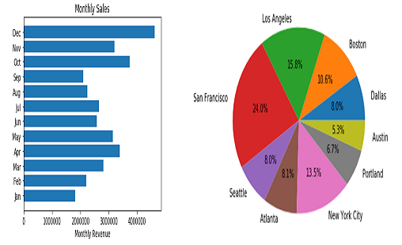

# KMart-Sales-Analysis-and-Visualizations

## Following factors are analysed and visualized:
- What was the best month for sales ?
- How much was earned that month ?
- Which city had the highest number of sales ?
- Recommend the most appropriate time to display advertising to maximize the likelihood of customer buying the product's ?
- What products are most often sold together ?
- What products sold the most ?
- Why do you think it sold the most ?
